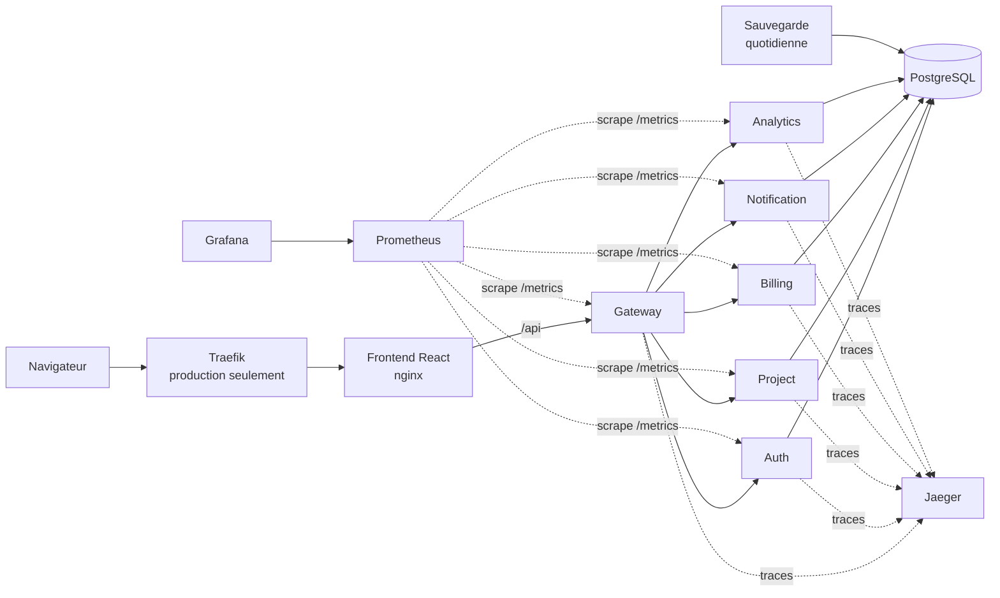

# CloudApp — Microservices, CI/CD et supervision

[](https://github.com/leopen10/cloudapp/actions/workflows/ci-build-push.yml)

Plateforme de gestion de projets et de facturation, découpée en microservices FastAPI,
livrée par une chaîne CI/CD GitHub Actions et supervisée par Prometheus et Grafana.
Projet réalisé dans le cadre du titre Administrateur d'Infrastructures Sécurisées (ESTIAM, Bac+3 Cybersécurité & Cloud).

## Architecture



| Composant | Rôle |
|---|---|
| Frontend | Interface React servie par nginx, qui relaie `/api/` vers le Gateway |
| Gateway (8000) | Point d'entrée de l'API, route les requêtes vers les services |
| Auth (8001) | Inscription et connexion, jetons JWT |
| Project (8002) | Clients et projets |
| Billing (8003) | Factures, calculées selon l'avancement des projets |
| Notification (8004) | Notifications internes (stockées en base) |
| Analytics (8005) | Événements et statistiques |
| PostgreSQL | Base de données commune, code partagé dans `services/shared` |
| Prometheus, Grafana | Métriques des services et tableaux de bord |
| Backup | Sauvegardes PostgreSQL quotidiennes, vérifiées par restauration (pile de production) |
| Jaeger | Traçage distribué OpenTelemetry (Gateway et les 5 services), non exposé publiquement |
| Traefik v3 | Reverse proxy de la pile de production (Docker Swarm) |

## Lancer le projet en local

Prérequis : Docker Desktop.

```bash
cp .env.example .env          # valeurs factices : suffisantes pour un usage local
docker compose -f docker-compose.test.yml up -d --build
```

| Adresse | Contenu |
|---|---|
| http://localhost:3000 | Application |
| http://localhost:8000/docs | Documentation Swagger du Gateway |
| http://localhost:9090 | Prometheus |
| http://localhost:3001 | Grafana |

Les ports ne sont ouverts que sur `127.0.0.1`. Les mots de passe et la clé de signature des connexions
se règlent dans le fichier `.env`, qui n'est jamais versionné.

## Tests

Chaque service a sa suite `pytest` dans `services/<nom>/tests/`. Les tests utilisent une base PostgreSQL :
la CI en démarre une jetable à chaque exécution.

## CI/CD (GitHub Actions)

| Workflow | Déclencheur | Rôle |
|---|---|---|
| `ci-pull-request.yml` | pull request | Lint, tests unitaires (avec PostgreSQL), scan Trivy des 7 images, test d'intégration de la pile complète |
| `ci-build-push.yml` | push sur `main` | Construction locale, **scan Trivy bloquant**, puis publication sur Docker Hub (tags `latest` et SHA du commit) |
| `cd-deploy.yml` | manuel | Déploiement Docker Swarm par SSH, tag d'image au choix (sert aussi de retour arrière), vérification de disponibilité |
| `cd-rollback.yml` | manuel | Retour à une version précédente |

## Sécurité

- Scan Trivy (CRITICAL et HIGH corrigeables) **avant** toute publication d'image.
- Aucun secret dans le dépôt : variables lues dans `.env` (ignoré par Git) en local, secrets GitHub en CI/CD.
- Images en deux étapes, exécutées par un utilisateur non privilégié, sans `setuptools` ni `wheel` dans l'image finale.
- Dépendances Python à version figée.
- Production : un seul port public (80, Traefik), réseau interne sans accès sortant, PostgreSQL et Prometheus non exposés.
- Workflows avec permissions minimales ; l'action Trivy est épinglée sur une version immuable.

## Déploiement

`docker-compose.prod.yml` décrit la pile Docker Swarm (nœud unique). Variables attendues au déploiement :
`DOCKER_USERNAME`, `IMAGE_TAG`, `POSTGRES_PASSWORD`, `JWT_SECRET_KEY`, `GRAFANA_ADMIN_PASSWORD`,
`RESEND_API_KEY` et `BACKUP_INTERVAL_SECONDS` (facultatives).
Dimensionnement : la somme des limites de mémoire atteint environ 1,7 Go, prévoir une instance de 2 Go de RAM.

La pile se valide en local, dans Docker Swarm (Docker Desktop), avec le script `scripts/swarm-local-test.ps1` :
il déploie la pile avec les images publiées sur Docker Hub, attend que tous les services soient prêts puis vérifie
l'accès par Traefik, l'inscription jusqu'à la base, Grafana, la collecte Prometheus, l'absence d'exposition de PostgreSQL
et la sauvegarde avec sa restauration.

L'infrastructure AWS utilisée pendant le développement est arrêtée : il n'y a pas de démonstration en ligne.

## Sauvegardes et restauration

Le service `backup` de la pile de production exécute `backup/backup.sh` : `pg_dump` compressé toutes les 24 h,
contrôle d'intégrité de l'archive (`gzip -t`), conservation de 7 jours, puis **vérification par restauration réelle**
dans une base temporaire, avec comparaison du nombre de lignes de chaque table. Les fichiers sont dans le volume Docker `backup_data` (`/backups`).

```bash
# Lancer une sauvegarde puis sa vérification à la demande
docker exec $(docker ps -q -f name=_backup) bash /usr/local/bin/backup.sh once
docker exec $(docker ps -q -f name=_backup) bash /usr/local/bin/backup.sh verify

# Restaurer une sauvegarde dans la base de production (depuis le conteneur backup)
gunzip -c /backups/<fichier>.sql.gz | psql -v ON_ERROR_STOP=1 -d "$PGDATABASE"
```

## Traçage distribué (OpenTelemetry + Jaeger)

Le Gateway et les 5 services (Auth, Project, Billing, Notification, Analytics) sont instrumentés
avec OpenTelemetry : chaque requête produit des spans (FastAPI, appels HTTP entre services, requêtes
SQLAlchemy), reliés par un même identifiant de trace et envoyés à Jaeger en OTLP/HTTP. Le tracage
est **facultatif à l'exécution** (actif seulement si `OTEL_EXPORTER_OTLP_ENDPOINT` est défini, ce qui
est le cas dans la pile de production) : une erreur de télémétrie n'empêche jamais un service de démarrer.
Les requêtes vers `/metrics` et `/health` sont exclues du traçage (bruit des contrôles périodiques).

Propagation testée sur deux vrais processus, avec un collecteur OTLP réel : la requête traverse le
Gateway et un service applicatif (y compris ses requêtes SQL) sous un seul et même identifiant de trace.

Jaeger n'est pas publié via Traefik (un seul port public dans la pile : 80). Pour consulter les traces :
```bash
# Expose temporairement l'interface, le temps d'une session de demonstration
docker service update --publish-add published=16686,target=16686,mode=host cloudprod_jaeger
# puis http://localhost:16686
# Retrait a la fin :
docker service update --publish-rm 16686 cloudprod_jaeger
```
`scripts/swarm-local-test.ps1` fait cette publication automatiquement pendant sa validation, et la retire avec `-Down`.

## Limites connues et pistes d'évolution

- **E-mails de notification** : l'envoi par e-mail n'est pas implémenté. Le service Notification enregistre les notifications en base.
- **HTTPS** : nécessite un nom de domaine (Let's Encrypt via Traefik).
- **Haute disponibilité** : la pile Swarm est mono-nœud, sans réplication de la base.
- **Sauvegardes hors site** : les sauvegardes restent sur le serveur (volume Docker). Une copie vers un stockage externe (S3) est à ajouter.
- **Infrastructure as code** (Terraform) : à écrire.
- **Migrations de base** : le schéma est créé au démarrage, sans outil de migration.

## Auteur

Leonel-Magloire PENGOU — ESTIAM Paris, Bac+3 Cybersécurité & Cloud
